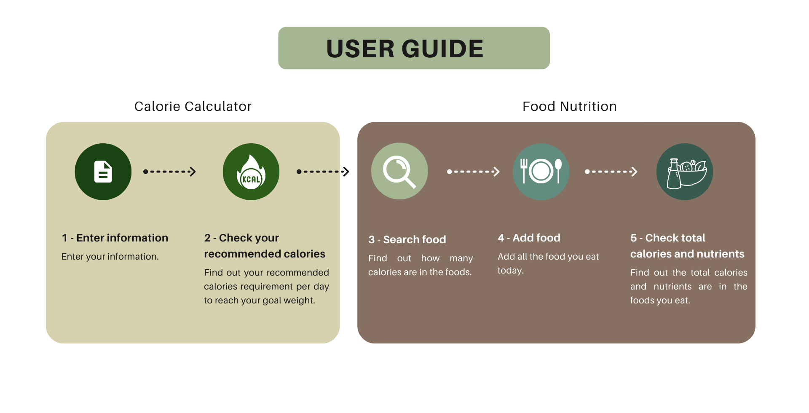
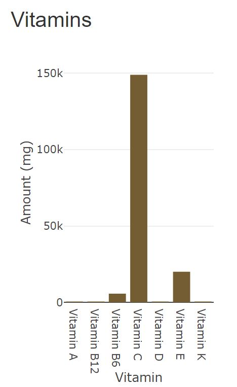
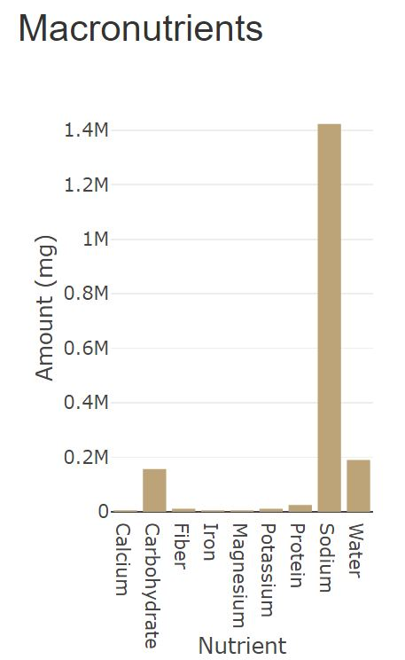

Healthy Planet
====================================
title: Healthy Planet
author: Introduction to Data Science
date: 23.06.2022
  
<strong><a href="https://github.com/wanyinggg/NutritionCalculator">GitHub Link</a></strong>   
<strong><a href="https://wanying.shinyapps.io/HealthyPlanet/">ShinyApp Link</a></strong>  

Introduction 
====================================
<body style= background-color:#EAF8F7>
<h5><strong>Problem</strong></h5>
People nowadays face a hectic life until they ignore their daily diets. This causes obesity becomes the most common disease occurs among Malaysians.
   
<h5><strong>Questions</strong></h5>

-How to find out your recommended calories requirement for the day?  
-How to find out the amount of calories and nutrients in the foods you eat?
 
<h5><strong>Stakeholders</strong></h5>  

-Ministry of Health  
-Nutritionist  
-Public who emphasize their diets 
 

Data
====================================
autosize: true
left: 60%

<h5><strong>Description of dataset</strong></h5>  

We found and retrieve the dataset from kaggle. The dataset contains 8790 rows and 77 columns, showing the nutrition values such as calories, fat, and vitamin for each type of food. These data are the fundamentals of food-based dietary guidelines for healthy nutrition.  
 
<strong><a href="https://www.kaggle.com/datasets/trolukovich/nutritional-values-for-common-foods-and-products">Dataset Link</a></strong>  
***
<h5><strong>Data Cleaning</strong></h5>  

We cleaned the data by removing the unit of each value to make the attributes numeric and deleting some unused columns. The cleaned dataset contained 8790 rows with 24 columns.    

<h5><strong>Data Analysis</strong></h5>  

The amount of nutrients contained in food will be displayed to estimate the nutrient intake from food consumption because adequate nutrition is one of the pillars of public health.

User Manual
====================================
<body style= background-color:#EAF8F7>

</body>

Data Story and Summary Of Experience
====================================
autosize: true
left: 60%
<h5><strong>Data Story</strong></h5>

 

 

***

<h5><strong>Summary of Experience</strong></h5>  
**We have learned the importance of:**
- Applying the data science process  
- Asking the specific and answerable questions
- Finding the right and suitable data  
- Collaborating with teammates to finish the project on time  

Key Takeways
====================================

 
-By showing the ideal weight, daily calories and portion of macro nutrients needed, Healthy Planet makes us pay more attention to our health.  
 
-We can make healthy choices when eating out, even at fast food restaurants. 
   
-Healthy Planet help us make informed food choices when grocery shopping and preparing food at home.  
   
-We can maintain better eating habits and aid in attaining a balanced energy level.

